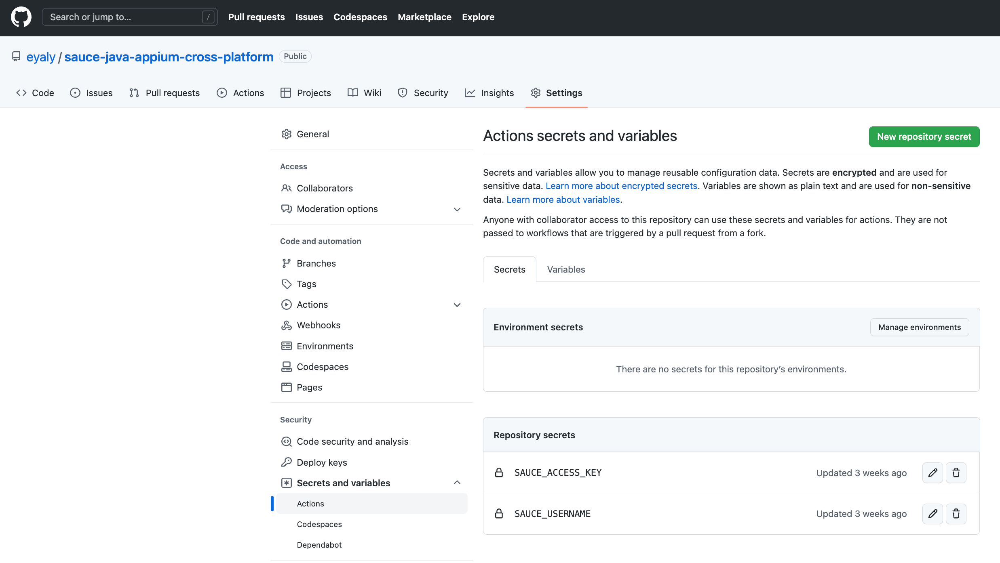
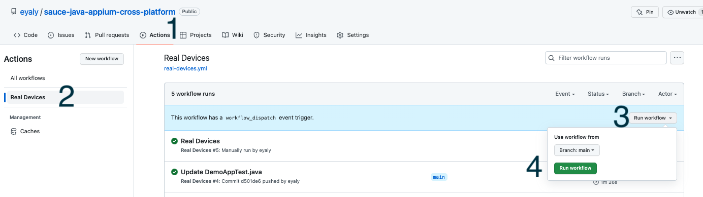
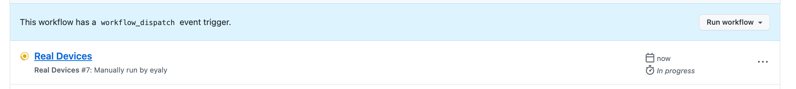
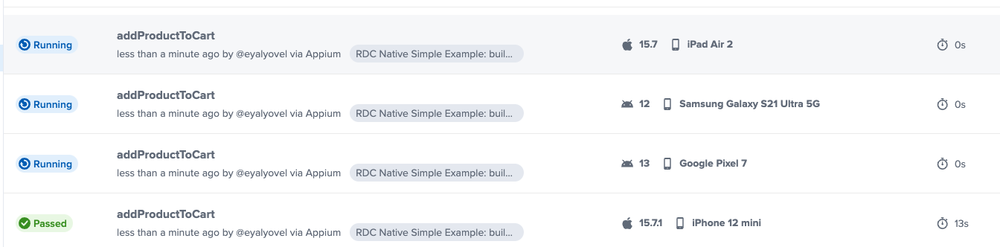
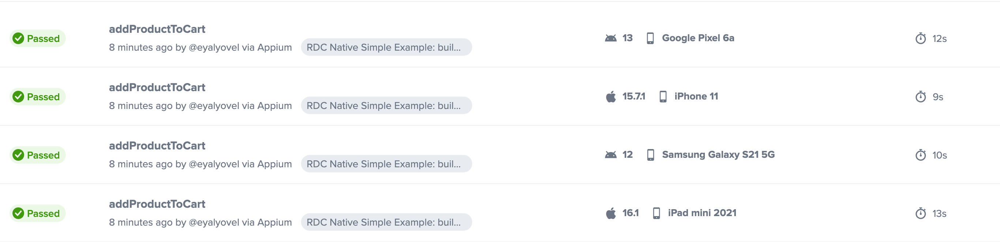

# Mobile testing w/ Appium + Java

Mobile automated testing using Appium and Java
---
## Setup  

### Sauce Labs setup
1. Free [Sauce account](https://saucelabs.com/sign-up)
2. Make sure you know how to find your Sauce Labs Username and Access Key by going to the [Sauce Labs user settings page](https://app.saucelabs.com/user-settings)

---
### Appium setup
1. We will run our automated tests on Sauce Labs devices; therefore, there is no need to install Appium Server.

---
### Demo app(s)   

1. The Android demo apps that has been used for the Android tests can be found [here](https://github.com/saucelabs/my-demo-app-android/releases).
2. The iOS demo apps that has been used for the iOS tests can be found [here](https://github.com/saucelabs/my-demo-app-ios/releases).   
Be aware of the fact that and iOS simulator uses a different build then a iOS real device. So please check the file you
download.

> The advice is to download the files to an `apps` folder in the root of this folder.

Make sure that when you downloaded the files from the releases page, that you rename the apps to the following:

- `mda-{#.#.#-#}.apk` => `my-demo-app-android.apk`
- `SauceLabs-Demo-App.ipa` => `SauceLabs-Demo-App.ipa`
- `Saucelabs-demo-app.simulator.zip` => `SauceLabs-Demo-App.Simulator.zip`

**If you don't do that then the scripts can't find the apps!**

#### Upload apps to Sauce Storage
If you want to use Android emulators, Android real devices, iOS simulators or iOS real devices in the Sauce Labs platform, you need to upload
the apps to the Sauce Storage.

#### Manual upload
Execute the following steps to manually upload the apps:
- Login to the Sauce Labs platform
- Go to **LIVE** > **Mobile App**
- Click on **App Upload** and OR select the folder, OR drag the apps to the screen to upload them

#### Automated upload
You can find a script to upload them to, OR the US, OR EU DC in [this](../../helpers/push_apps_to_storage.sh)-file. You can push the files to the
storage by doing the following from the folder `appium-app-examples`:

    cd src/test/java/sauce/demo/helpers/
    ./push_apps_to_storage.sh

---
### Gitpod setup

ℹ Gitpod lets you run an entire Dev environment from a browser! You can use this approach if you don't have time or you don't know how to setup a local Java environment.

1. Sign up for a free [GitHub account](https://github.com/)
2. [Fork this repository](https://docs.github.com/en/get-started/quickstart/fork-a-repo)
 * Make sure you are logged into GitHub
 * Click the Fork in the upper right of the GitHub.
 * Give the repo a ⭐ while you're here 🤩
3.In the browser address bar, add your GitHub url (`https://github.com/USERNAME/this-repo-name`) with `https://gitpod.io/#`
    * The resulting url should look as follows:
   
      > https://gitpod.io/#https://github.com/USERNAME/sauce-java-appium-cross-platform
   
4. Once the Gitpod.io URL is loaded, you will need to sign in with the GitHub account you created earlier 
5. Once the development environment is loaded, you should see 'Ready to test!' in the Terminal window in the lower portion of the window, run the following commands in that Terminal to set your `SAUCE_USERNAME`, `SAUCE_ACCESS_KEY`:

```bash
eval $(gp env -e SAUCE_USERNAME=<sauce_username>)
eval $(gp env -e SAUCE_ACCESS_KEY=<sauce_access_key>)
```

> Replace <sauce_username>, <sauce_access_key> with your credentials

Once you have run those 2 commands, you can run the following commands to test your environment variables:

```bash
echo $SAUCE_USERNAME
echo $SAUCE_ACCESS_KEY
```

Run the tests

```java
        // If using the US DC
        mvn clean test -Dregion=us

        // If using the EU DC
        mvn clean test -Dregion=eu
```

<br/>
  <details>
    <summary>
      <strong>Click here</strong> to see an example console output.
    </summary>

      [INFO]
      [INFO] -------------------------------------------------------
      [INFO]  T E S T S
      [INFO] -------------------------------------------------------
      [INFO] Running TestSuite
      Sauce Android Native App  - Before hook
      *** BeforeMethod hook. Running method addProductToCart ***
      Sauce Android Native App  - Before hook
      *** BeforeMethod hook. Running method addProductToCart ***
      region is eu
      region is eu
      region is eu
      region is eu
      Sauce - Start selectProduct test
      Sauce - Start selectProduct test
      Sauce - AfterMethod hook
      Sauce - AfterMethod hook
      Sauce - Start selectProduct test
      Sauce - release driver
      Sauce - Start selectProduct test
      Sauce - AfterMethod hook
      Sauce - release driver
      Sauce - AfterMethod hook
      [INFO] Tests run: 4, Failures: 0, Errors: 0, Skipped: 0, Time elapsed: 31.102 s - in TestSuite
      [INFO]
      [INFO] Results:
      [INFO]
      [INFO] Tests run: 4, Failures: 0, Errors: 0, Skipped: 0
      [INFO]

  </details>

<br/>

#### In the next video I demo how to fork a repo and connect to Gitpod:

https://user-images.githubusercontent.com/6969588/177877688-f735e152-991d-4c7e-a326-0a9a2969fea9.mp4

---

### Local environment setup

1. Sign up for a free [GitHub account](https://github.com/)
2. [Fork this repository](https://docs.github.com/en/get-started/quickstart/fork-a-repo)
 * Make sure you are logged into GitHub
 * Click the Fork in the upper right of the GitHub.
 * Give the repo a ⭐ while you're here 🤩
3. Clone **your fork** of the repository to your machine. Must have [Git installed](https://git-scm.com/downloads)

```bash
git clone URL_OF_YOUR_FORK
```

Setup environment variables on your system
* [Mac/Linux](https://docs.saucelabs.com/basics/environment-variables/#setting-up-environment-variables-on-macos-and-linux-systems)
* [Windows](https://docs.saucelabs.com/basics/environment-variables/#setting-up-environment-variables-on-windows-systems)

Run the tests

```java
        // If using the US DC
        mvn clean test -Dregion=us

        // If using the EU DC
        mvn clean test -Dregion=eu
```

<br/>
  <details>
    <summary>
      <strong>Click here</strong> to see an example console output.
    </summary>

      [INFO]
      [INFO] -------------------------------------------------------
      [INFO]  T E S T S
      [INFO] -------------------------------------------------------
      [INFO] Running TestSuite
      Sauce Android Native App  - Before hook
      *** BeforeMethod hook. Running method addProductToCart ***
      Sauce Android Native App  - Before hook
      *** BeforeMethod hook. Running method addProductToCart ***
      region is eu
      region is eu
      region is eu
      region is eu
      Sauce - Start selectProduct test
      Sauce - Start selectProduct test
      Sauce - AfterMethod hook
      Sauce - AfterMethod hook
      Sauce - Start selectProduct test
      Sauce - release driver
      Sauce - Start selectProduct test
      Sauce - AfterMethod hook
      Sauce - release driver
      Sauce - AfterMethod hook
      [INFO] Tests run: 4, Failures: 0, Errors: 0, Skipped: 0, Time elapsed: 31.102 s - in TestSuite
      [INFO]
      [INFO] Results:
      [INFO]
      [INFO] Tests run: 4, Failures: 0, Errors: 0, Skipped: 0
      [INFO]

  </details>

<br/>

## Running GitHub Actions
You can run the Appium tests directly from GitHub using GitHub Actions   
1. Add two new variables: SAUCE_USERNAME and SAUCE_ACCESS_KEY to your GitHub Repository Secret, as shown in the snapshot    
       
     
More info can be found [here](https://docs.github.com/en/actions/security-guides/encrypted-secrets).    
2. Select (1) Actions tab -> (2) Click on "Real Devices" (3) Click "Run workflow" and (4) Run workflow
      
3. GitHub Actions starts to run     
       
4. You should see four test executions running in Sauce Labs platform
       
5. Wait till the tests passed
        

## Extra resources

- [Appium options for sauce](https://docs.saucelabs.com/dev/test-configuration-options/#mobile-app-appium-capabilities-required)
- [All appium capabilities](https://appium.io/docs/en/writing-running-appium/caps/)
- [More Appium resources](https://github.com/saucelabs-training/demo-java/blob/main/TRAINING.md)
